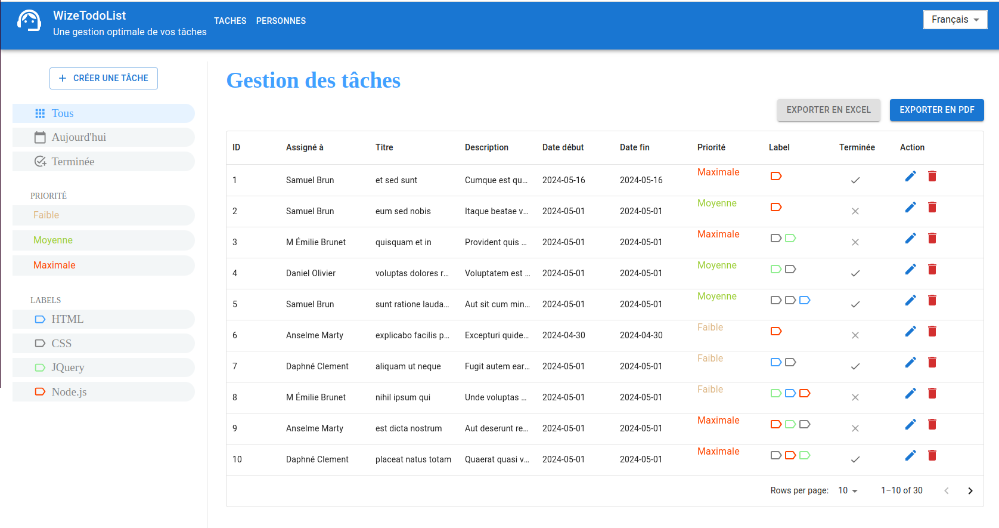

# WizeTodoList




## Description
Ce dépôt contient le code source d'une application simple de liste de tâches construite en utilisant Node.js, React et MUI. L'application permet aux utilisateurs de créer, mettre à jour et supprimer des tâches de leur liste de tâches. Elle offre une interface propre et intuitive pour la gestion des tâches, avec des fonctionnalités telles que la priorisation des tâches et les dates d'échéance. L'application est conçue pour être légère et facile à utiliser, ce qui la rend adaptée aux besoins de gestion des tâches personnels et professionnels.


Ce guide contient les fichiers nécessaires pour exécuter une application Node.js à l'aide de Docker Compose, avec des configurations distinctes pour les environnements de développement et de production.

## Utilisation de l'image Docker depuis Docker Hub

(https://hub.docker.com/r/oracions/wizetodolist)

Vous pouvez exécuter l'image Docker `oracions/wizetodolist` directement depuis Docker Hub en suivant ces étapes simples :

1. Assurez-vous d'avoir Docker installé sur votre machine. Si ce n'est pas le cas, vous pouvez le télécharger et l'installer à partir du [site officiel de Docker](https://www.docker.com/get-started).

2. Ouvrez un terminal ou une invite de commandes.

3. Exécutez la commande suivante pour tirer (pull) l'image Docker depuis Docker Hub :

```bash
    docker pull oracions/wizetodolist
```

4. Une fois l'image téléchargée, vous pouvez exécuter un conteneur à partir de cette image en utilisant la commande suivante :

```bash
    docker run -p 8080:80 oracions/wizetodolist
```
5. L'application est accessible sur le port 8080 en locale.

## Configuration des environements

### Prérequis

Avant de commencer, assurez-vous d'avoir Node.js installé sur votre système. Si ce n'est pas le cas, vous pouvez le télécharger et l'installer à partir du [site officiel de Node.js](https://nodejs.org/).


Assurez-vous également d'avoir Docker et Docker Compose installés sur votre système. Pour installer Docker et Docker Compose, suivez les instructions officielles :

- Docker : [Guide d'installation Docker](https://docs.docker.com/get-docker/)
- Docker Compose : [Guide d'installation Docker Compose](https://docs.docker.com/compose/install/)


### Clonner du dépôt

Clonez ce dépôt sur votre machine locale en utilisant la commande suivante :

```bash
git clone https://github.com/will-oracions/wizeTodoList
```

### Lancement de l'application

#### Environnement de développement
L'environnement de développement est conçu pour faciliter le processus de développement de l'application. Il utilise le Dockerfile de développement et expose l'application sur le port 7777. Dans cet environnement, vous pouvez modifier le code source de l'application en temps réel, et les changements seront reflétés instantanément. De plus, les fichiers sont montés en tant que volume, ce qui permet une intégration transparente avec les outils de développement locaux. 

Pour lancer l'application en environnement de développement, exécutez la commande suivante :

```bash
docker-compose -f docker-compose.dev.yml up --build
```

L'application est accessible sur le port 7777 en locale (`http://localhost:7777`).


#### Environnement de développement
L'environnement de production est optimisé pour déployer l'application dans un environnement de production. Il utilise le Dockerfile de production et expose l'application sur le port 7770. Dans cet environnement, l'application est construite avec les optimisations de production et est prête à être déployée sur un serveur en production. Le Dockerfile.prod utilise une stratégie multi-étapes pour construire une image Docker légère et sécurisée, en utilisant une image Nginx Alpine pour le déploiement. Pour lancer l'application en environnement de production, exécutez la commande suivante

Pour lancer l'application en environnement de développement, exécutez la commande suivante :

```bash
docker-compose -f docker-compose.dev.yml up --build
```

L'application est accessible sur le port 7770 en locale (`http://localhost:7770`).
